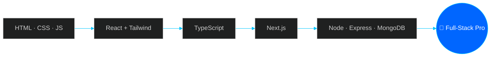

<a name="top"></a>

<!-- ===================== HERO ===================== -->
<p align="center">
  
</p>

<p align="center">
  <a href="https://github.com/mdmahadih673">
    
  </a>
</p>

<p align="center">
  <a href="#about"></a>
  <a href="#skills"></a>
  <a href="#projects"></a>
  <a href="#analytics"></a>
  <a href="#journey"></a>
  <a href="#connect"></a>
</p>

<p align="center">
  <a href="https://github.com/mdmahadih673"></a>
  <a href="https://github.com/mdmahadih673?tab=repositories"></a>
  
  
</p>

<p align="center">
  
  
  
  
</p>

<!-- ===================== ABOUT ===================== -->
<a name="about"></a>


## 👨‍💻 &nbsp;About Me

<table>
<tr>
<td width="52%" valign="top">

I'm a passionate web developer who turns ideas into **fast, responsive and interactive web applications**.

I enjoy the full journey of a project: designing the UI, structuring the components, connecting the API, and shipping it to production. Right now I'm going deep into **React, TypeScript, Next.js and full-stack development**.

- 🔭 Building with **Next.js + TypeScript**
- 🌱 Leveling up **Node.js, Express & MongoDB**
- 🎯 Goal: **Professional Full-Stack Developer**
- ⚡ Love clean UI, clean code, clean architecture
- 🤝 Open to **internships, junior roles & collaborations**

</td>
<td width="48%" valign="top">

```bash
~ $ whoami
mahadi

~ $ cat profile.json
{
  "name": "Md. Mahadi Hasan",
  "role": "MERN Stack Developer",
  "location": "Bangladesh 🇧🇩",
  "frontend": ["React", "Next.js", "TS"],
  "backend": ["Node", "Express", "Mongo"],
  "mindset": "Build. Break. Fix. Repeat.",
  "status": "Learning & Shipping 🚀"
}

~ $ echo $NEXT_GOAL
"Ship a production full-stack app"
```

</td>
</tr>
</table>

<!-- ===================== WHAT I DO ===================== -->
## 🧩 &nbsp;What I Do

<table>
<tr>
<td width="33%" valign="top" align="center">

### 🎨 Frontend
Responsive, accessible and pixel-clean interfaces with **React, Next.js & Tailwind CSS**.

</td>
<td width="33%" valign="top" align="center">

### ⚙️ Backend
REST APIs, authentication and business logic with **Node.js & Express**.

</td>
<td width="33%" valign="top" align="center">

### 🗄️ Database
Schema design and data modeling with **MongoDB**.

</td>
</tr>
</table>

<!-- ===================== SKILLS ===================== -->
<a name="skills"></a>


## ⚡ &nbsp;Tech Arsenal

<table align="center">
<tr>
<td align="center" width="33%">
<b>🎨 Frontend</b><br/><br/>

</td>
<td align="center" width="33%">
<b>⚙️ Backend & DB</b><br/><br/>

</td>
<td align="center" width="33%">
<b>🧰 Tools</b><br/><br/>

</td>
</tr>
</table>

<details>
<summary><b>📚 Concepts I work with (click to expand)</b></summary>
<br/>

<p align="center">
  
  
  
  
  
  
</p>

</details>

<!-- ===================== PROJECTS ===================== -->
<a name="projects"></a>


## 🚀 &nbsp;Featured Projects

<p align="center">
  <a href="https://github.com/mdmahadih673/assienment-6">
    
  </a>
  <a href="https://github.com/mdmahadih673/assienment-5">
    
  </a>
</p>

### 💪 Fit Log &nbsp;·&nbsp; Workout Tracker

> A workout tracking app where users can explore workouts, save exercises and manage their personal workout plan.

| | |
|---|---|
| **✨ Features** | Browse workouts • Save favorite exercises • Manage a personal plan |
| **🛠️ Stack** |     |
| **🔗 Links** | [](https://github.com/mdmahadih673/assienment-6) <!-- [](YOUR_LIVE_LINK) --> |

### 🧰 Dev Stack Builder &nbsp;·&nbsp; Tech Stack Manager

> A technology stack management app where users can explore technologies and build their own personalized stack.

| | |
|---|---|
| **✨ Features** | Explore technologies • Build a custom stack • Clean, fast UI |
| **🛠️ Stack** |     |
| **🔗 Links** | [](https://github.com/mdmahadih673/assienment-5) <!-- [](YOUR_LIVE_LINK) --> |

### 📁 FileFlow &nbsp;·&nbsp; File Organizer *(experimental)*

> An experimental desktop file organizer focused on simplifying file management and organization.

| | |
|---|---|
| **🛠️ Stack** |   |
| **🔗 Links** | [](https://github.com/mdmahadih673/fileflow) |

<p align="center">
  <a href="https://github.com/mdmahadih673?tab=repositories">
    
  </a>
</p>

<!-- ===================== NOW ===================== -->


## 🎯 &nbsp;Right Now

<table>
<tr>
<td width="33%" valign="top">

### 🔨 Building
Full-stack projects with **Next.js, TypeScript & MongoDB**.

</td>
<td width="33%" valign="top">

### 📖 Learning
Advanced React patterns, **Next.js App Router**, backend architecture.

</td>
<td width="33%" valign="top">

### 🤝 Looking For
Internships, junior roles & open-source collaboration.

</td>
</tr>
</table>

<p align="center">
  
  
  
  
  
</p>

<!-- ===================== ANALYTICS ===================== -->
<a name="analytics"></a>


## 📊 &nbsp;GitHub Analytics

<p align="center">
  
  
</p>

<p align="center">
  
</p>

<p align="center">
  
</p>

<p align="center">
  <picture>
    <source media="(prefers-color-scheme: dark)" srcset="https://raw.githubusercontent.com/mdmahadih673/mdmahadih673/output/github-snake-dark.svg" />
    <source media="(prefers-color-scheme: light)" srcset="https://raw.githubusercontent.com/mdmahadih673/mdmahadih673/output/github-snake.svg" />
    
  </picture>
</p>

<!-- ===================== JOURNEY ===================== -->
<a name="journey"></a>


## 🗺️ &nbsp;My Journey



## 🧠 &nbsp;How I Build

<table>
<tr>
<td width="25%" align="center"><b>1️⃣ Plan</b><br/><sub>Understand the problem, sketch the UI & data</sub></td>
<td width="25%" align="center"><b>2️⃣ Build</b><br/><sub>Small reusable components, typed code</sub></td>
<td width="25%" align="center"><b>3️⃣ Refine</b><br/><sub>Responsive checks, cleanup, refactor</sub></td>
<td width="25%" align="center"><b>4️⃣ Ship</b><br/><sub>Deploy, gather feedback, iterate</sub></td>
</tr>
</table>

<details>
<summary><b>💡 Dev principles I follow</b></summary>
<br/>

- **Readable code > clever code**
- **Mobile-first**, then scale up
- **Type safety** saves future me
- **Small commits**, clear messages
- **Ship early**, improve continuously

</details>

<details>
<summary><b>❓ FAQ</b></summary>
<br/>

**What are you working on now?** Full-stack apps with Next.js, TypeScript and MongoDB.

**Are you open to work?** Yes, internships, junior roles and collaborations.

**How can I reach you?** Email or GitHub (links below).

</details>

<!-- ===================== QUOTE ===================== -->
<p align="center">
  
</p>

<!-- ===================== CONNECT ===================== -->
<a name="connect"></a>


## 🤝 &nbsp;Let's Connect

<p align="center"><i>Have an idea, a project or an opportunity? Let's build something great together.</i></p>

<p align="center">
  <a href="https://github.com/mdmahadih673"></a>
  <a href="mailto:your-email@example.com"></a>
  <!-- Uncomment & edit:
  <a href="YOUR_LINKEDIN_URL"></a>
  <a href="YOUR_PORTFOLIO_URL"></a>
  <a href="YOUR_FACEBOOK_URL"></a>
  -->
</p>

<p align="center">
  <a href="#top"></a>
</p>

<p align="center">
  <b>⭐ Thanks for visiting my profile!</b><br/>
  <sub>Built with curiosity • Powered by code • Always learning 🚀</sub>
</p>


